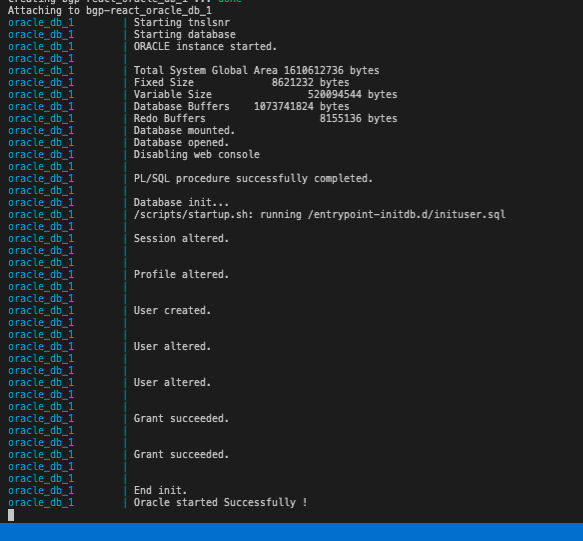

# Oracle 12c Release 2 Docker Image

Docker image for Oracle 12c Release 2 on CentOS, with database SID /xe persisted in image. Allows for faster init of db in CICD pipelines.

Base image is from: https://github.com/MaksymBilenko/docker-oracle-12c

Installation script for database inspired by https://github.com/PengBAI/docker-oracle-12c-R1.

## Description

Pull image:

```bash
docker pull houdinisparks/oracle_db:12.2.0.2-latest
```

Run with 8080 and 1521 ports opened:

```bash
docker run -d -p 8080:8080 -p 1521:1521 pengbai/docker-oracle-12c-r1
```

Connect database with following setting:

```bash
hostname: localhost
port: 1521
sid: xe
username: system
password: oracle
```

### To run init sql scripts
Execute automatically init scripts sql on contaner startup:

In folder where you put your ```*.sql``` files for database init from /local-initdb to ```/entrypoint-initdb.d``` in contaner

```bash
docker run -p 1521:1521 -v /local-initdb:/entrypoint-initdb.d houdinisparks/oracle_db:12.2.0.2-latest
```



Note: This image has apex web console disabled (redundant for CICD pipelines). See `scripts/startup.sh`.
